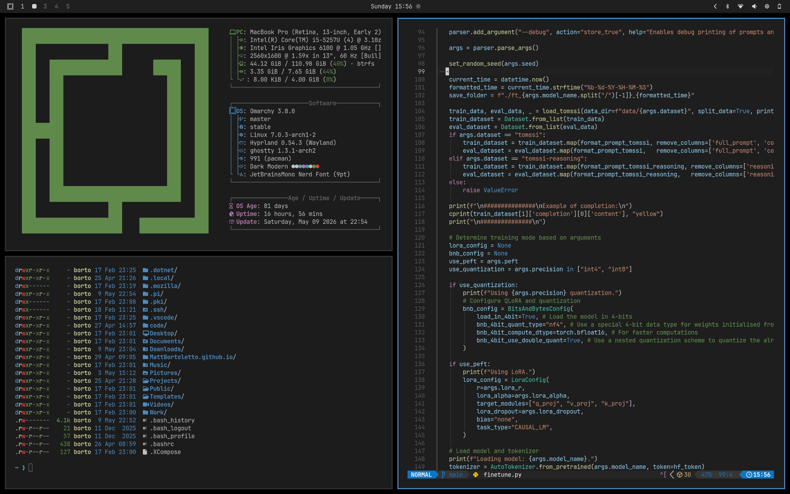

# Dark Modern theme for Omarchy

Simple theme for [Omarchy](https://omarchy.org/) based on the classic Dark Modern theme for VSCode.




## Quick start
Simply run:

```bash
omarchy-theme-install https://github.com/MattBortoletto/omarchy-dark-modern-theme
```


## Attribution

- VSCode theme for neovim by Mofiqul: https://github.com/Mofiqul/vscode.nvim
